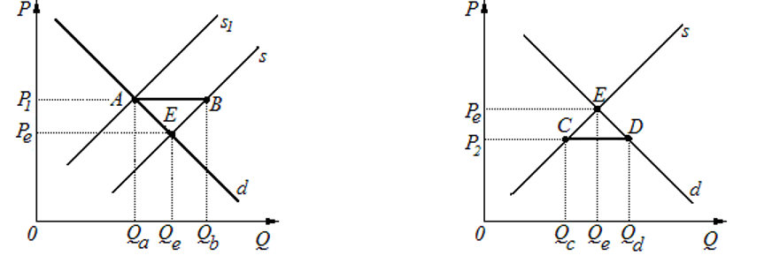
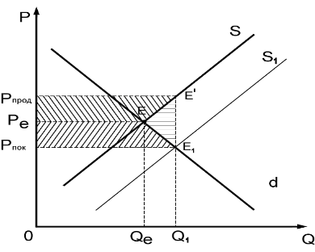

## Налоги
**Налог**— это обязательный платеж, взимаемый государством с юридических и физических лиц для финансирования своих экономических и социальных функций.

##### Рис. 1.1 - Введение потоварного налога на производителя
– сокращение производства в стране с $Qe$ до $Q1$;
– повышение цен с $Рe$ до $P+$;
– сокращение выручки производителей и, соответственно, будущих инвестиций с площади прямоугольника $0Р_eЕQ_e$ до площади прямоугольника $0P^-АQ_1$, если же рассматривать прибыль, то она может сократиться еще значительнее, поскольку при введении налогов наряду с сокращением выручки возрастут затраты;
– потери для общества, которые составят площадь треугольника $E_1АЕ$, из которого потери потребителя составят площадь треугольника $E_1ЕВ,$ а потери производителя, соответственно, – ВЕА.

#### Рис. 1.2 - Введение налога на покупателя

Как видно из рис. 1.2, бремя налога также распределяется между покупателем и производителем.
Налоговое бремя на покупателя составит площадь прямоугольника $Р^+АВРе$, на продавца – $Р_еВЕ_1Р^–$.
Последствия будут такими же.
##  Фиксированные цены

Государство может устанавливать фиксированные цены, которые бывают двух видов: поддерживающие и потолочные.

_Поддерживающие цены_ применяются государством для поддержания производителей в некоторых отраслях экономики, например в сельском хозяйстве или в оборонной промышленности. Эта цена может устанавливаться как самостоятельно государством, так и под давлением самих производителей.

Поддерживающая цена бывает выше равновесной, поэтому производители могут получить более высокую прибыль. Однако при этом государство должно учитывать некоторые негативные последствия, в частности возникновение избытка продукции [AB], так как по цене $P_1$ производится объем продукции $Q_b$, а желают приобрести лишь $Q_a$

Рис. 1.4 - Поддерживающие цены                                        Рис. 1.5 - Потолочные цены

_Потолочные цены_ используются для оказания потребителям социальной поддержки. Потолочная цена – ниже равновесной. Однако установление цены реализации ниже равновесной приводит к такому негативному явлению, как дефицит [CD], потому что по цене _$Р_2$ потребители желают приобрести объем продукции в размере $Q_d$, а производителями предлагается лишь $Q_c$

Рис. 1.6 -  Черный рынок

$P_e$– рыночная цена. Она обеспечивает наибольший объем  реализации 0 $Q_е$. Однако в связи с тем, что продажа продукции выше цены $P_Г$ является незаконной, производитель предпочитает реализовывать ее по цене черного рынка, которая значительно выше рыночной цены, так как включает плату за риск  $Р_r Р_е$ . Чем больше риск, тем выше будет уровень цены черного рынка.
## Дотации
**Дотации** **–** это бюджетные средства вышестоящего уровня, которые выделяются нижестоящему уровню для покрытия текущих расходов

Рис. 1.7 - Предоставление дотаций потребителям

Величина дотации, оставшейся в распоряжении покупателя, составит площадь фигуры $P_{пок}PE^`Е_1E^{``}$ Весь объем дотации будет равен площади $P_{пок}E^`E_1P_{прод}$. При предоставлении дотаций потребителям объем производства увеличивается с $Q_e$ до $Q_1$, потери общества отсутствуют, однако при этом возрастает цена.

Рис. 1.8 - Предоставление субсидий производителю

Весь объем субсидии будет равен площади $$P_{прод}E^`E_1P_{пок}$$. При этом потери общества составят площадь треугольника  $$Е^`EE_1$$. Упущенная выгода возникает у производителя за cчет того, что он продает не по цене $P_{прод}$, а по цене $P_{пок}$, поэтому у него будут меньшие возможности для будущего инвестирования.