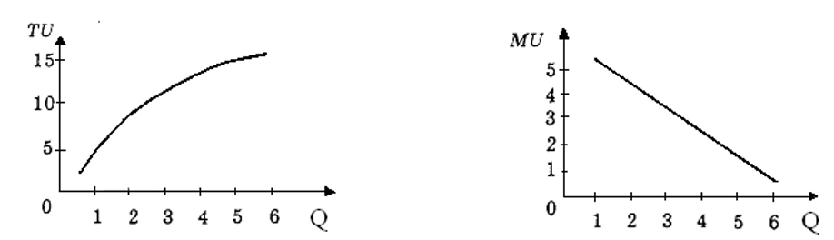
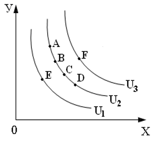
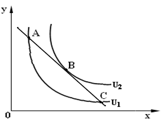
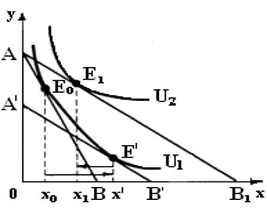

## Кардиналистский подход к оценке полезности

**Кардиналистский** – это количественный подход к оценке полезности. При данном подходе полезность измеряется в гипотетических единицах $U= f(x) -> max$
$$MU = \frac {\bigtriangleup TU} {\bigtriangleup x}$$

$$\frac{MUa}{Pa}=\frac {MUb}{Pb}=\frac{MUc}{Pc}=\lambda$$

где TU – общая полезность всех потребленных блага; MU – полезность каждого последующего потребляемого блага, $\bigtriangleup x$ – это дополнительная единица потребляемого блага, $\lambda$ – полезность денег; $Рс$– цена товара С; $MUс$ – предельная полезность товара С; $\frac {MUc} {Pc}$  – взвешенная предельная полезность товара

**_По первому закону Г. Г. Госсена (закон убывающей предельной полезности)_** предельная полезность в непрерывном акте потребления уменьшается, то есть каждая последующая единица блага приносит все меньше и меньше удовлетворения

Рис. 2.1  - Убывание полезности последующей единицы потребляемого блага.

Рис. 2.2 - График общей  полезности                  Рис. 2.3 - График предельной полезности

**Цена спроса** – это предельная полезность, выраженная в деньгах. Так, например, если предельная полезность третьего яблока для потребителя равна десяти, а рубль для потребителя имеет полезность равную двум, то цена спроса на третье яблоко у потребителя будет равна пяти. То есть потребитель не согласен покупать третье яблоко дороже пяти рублей.
## Ординалистский подход к оценке полезности
$$\frac {MUx} {Px} \geqslant \lambda$$
$$\frac {MUy} {Py} \leqslant \lambda$$
Ординалистский подход основывается на трех основных аксиомах.

1. Аксиома полной упорядоченности.
   Все наборы товаров можно упорядочить с помощью знаков:            
   $\prec$  (предпочтение) или ~ (безразличие), то есть _А_ $\prec$ _В_ или _А_ ~ _В_.
2. _Аксиома транзитивности._
   Если _А_ $\succ$ _В_ и _В_ $\succ$ С, то _А_ $\succ$ _С_;
   если _А_ $\succ$ _В_ и _В_  ~ _С_, то _А_ $\succ$_С_;
   если _А_ ~ _В_ и _В_ $\succ$ _С_, то _А_ $\succ$ _С_.
3. _Аксиома ненасыщения._ 
   Если в наборе _В_ на единицу меньше, чем в _А_, то _А_ $\succ$ _В_.
   Данный подход предполагает технику кривых безразличия. На основе табл. 3 можно построить линию _ABCD_, представленную на рис. 2.4.
   
   ### **_Свойства кривых безразличия_**:
1. Кривая, лежащая выше и правее ($U_3$), отражает более предпочтительные наборы. Кривая, лежащая ниже и левее (_$U_1$), отражает менее предпочтительные наборы. Все наборы товаров, представленные на рис. 2.4, можно упорядочить с помощью знаков предпочтения и безразличия: F $\succ$ A ~ В ~ C ~ D$\succ$E.
2. Кривые безразличия не пересекаются (доказательство от обратного). Кривые безразличия не могут пересекаться, так как в противном случае нарушатся первая и вторая аксиомы ординалистского подхода.
3. Кривые безразличия имеют отрицательный наклон, поскольку при уменьшении блага _У_ необходимо увеличить благо _Х_, чтобы общая полезность не изменилась.
4. Кривые безразличия являются вогнутыми или выпуклыми в начало координат, что объясняется уменьшающейся предельной нормой замены одного блага другим.

    
    
	Рис. 2.4 - Карта кривых безразличия

Предельная норма замены блага _У_ благом _Х_ ($MRSxy$) – это такое количество блага _У_, которое надо уменьшить при увеличении блага _Х_ на единицу так, чтобы общая полезность не изменилась.
Предельная норма замены находится по формуле:
$$MRSxy = \frac {\bigtriangleup y} {\bigtriangleup x} = -tg \alpha$$
**_Бюджетное ограничение_**
Если кривые безразличия отражают желания потребителя, то бюджетная линия, или бюджетное , отражает его возможности.
Если потребитель будет тратить свой доход на приобретение товара _Х_ (продукты) по цене _Px_ и товара _У_ (одежда) по цене _Pу_, и при этом он потратит свой доход полностью, то уравнение бюджетной линии будет имеет следующий вид:
$$I = P_Xx + P_yy$$
,где _I_ – это доход потребителя.
Выразив из данного уравнения _у_, мы получим следующую запись бюджетного ограничения:
$$y =\frac{I}{Py}-\frac{Px}{Py}x$$

## Оптимум потребителя

**Равновесие** потребителя будет достигнуто в том случае, если желания совпадут с возможностями, поэтому у потребителя есть два пути достижения оптимума: увеличивать финансовые возможности или ограничивать потребности.

**Оптимум** потребителя достигается в том случае, когда предельная норма замены одного товара другим будет равна обратному соотношению цен этих товаров, то есть когда выполнится следующее равенство:
$$MRSxy = - \frac {\bigtriangleup y} {\bigtriangleup x} = - \frac {Px} {Py}$$
С учетом кардиналистского подхода данное равенство можно записать следующим образом:
$$\frac {\bigtriangleup y} {\bigtriangleup x} = \frac {Px} {Py}= \frac{MUx} {MUy}$$
Графическое изображение оптимума
Оптимум будет достигнут в точке _В_ (рис. 2.5), поскольку в данной точке субъект от своего дохода получит максимально возможную полезность.

Рис. 2.5 - Оптимум потребителя

## Эффект замены и эффект дохода
**_Эффект замены_** заключается в том, что потребитель заменяет приобретение товара _У_ покупкой подешевевшего товара _Х_. Если есть набор двух товаров, на приобретение которых потребитель расходует свой доход, например мясо и рыба, то при снижении цены на рыбу потребитель заменяет приобретение относительно более дорогого мяса покупкой рыбы, которая подешевела. При эффекте замены происходит движение по прежней кривой безразличия ($U_1$), то есть полезность не увеличивается и реальный доход остается неизменным.

**_Эффект дохода_** проявляется в увеличении реального дохода потребителя (при неизменном денежном доходе), которое произошло вследствие уменьшения цены на товар _Х_. Данный эффект заключается в том, что после покупки достаточного количества товара _Х_ потребитель может направить сэкономленные деньги на приобретение более дорогого и престижного товара _У_.

Рис. 2.7- Эффект замены и эффект дохода для качественного блага
Пусть цена товара _X_ снизилась с $Р_X$ до $Р_{X1}$_. В этом случае новая бюджетная линия $AB_1$ имеет точку касания  $Е_1$ с кривой безразличия $U_2$. Это новый оптимум потребителя. Таким образом, при первоначальной цене потребитель покупает $x_0$ единиц товара X_, при новой цене – $x_1$  единиц товара _X_, то есть общим эффектом от снижения цены является увеличение объема спроса на товар _X_ на ($x_1$ – $x_0$) единиц.

Рис. 2.9- Эффект замены и эффект дохода для низкокачественного блага
При этом эффект замены (x' –$x_0$) больше эффекта дохода   ($x_1$ – x').  Общий эффект будет ($x_1$ – $x_0$) = (x' – $x_0$) – ($x_1$ – x'). Разложение общего эффекта от снижения цены на эффект замены и эффект дохода для этого случая представлено

Рис. 2.10 - Эффект замены и эффект дохода для некачественного блага
При этом эффект дохода   ($x_1 – x'$) будет больше замены ($x'-x_0$). Общий эффект будет ($x_1-x_0$) = ($x_1- x'$) – ($x'-x_0$). Разложение общего эффекта от снижения цены на эффект замены и эффект дохода для этого случая представлено на рис