# 1. Государственное регулирование рынка; фиксированные цены, налоги и дотации
## Налоги

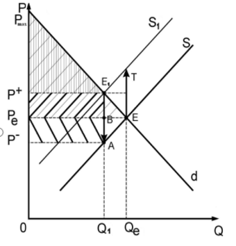

##### Рис. 1.1 - Введение потоварного налога на производителя

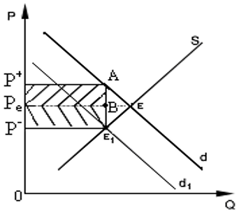
#### Рис. 1.2 - Введение налога на покупателя

##  Фиксированные цены

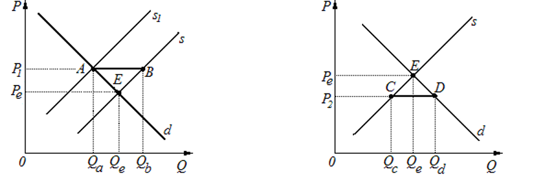

Рис. 1.4 - Поддерживающие цены                                        Рис. 1.5 - Потолочные цены

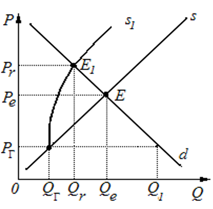

Рис. 1.6 -  Черный рынок
## Дотации

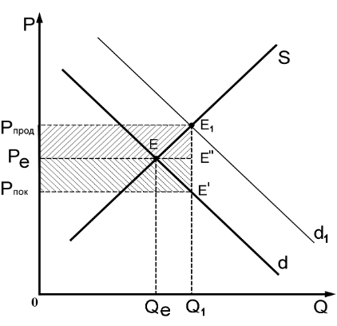

Рис. 1.7 - Предоставление дотаций потребителям

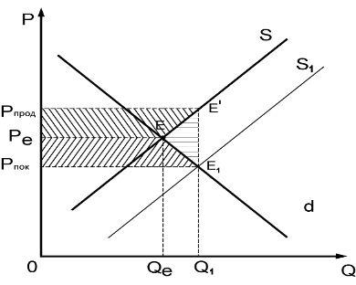

Рис. 1.8 - Предоставление субсидий производителю

# 2.Кардиналистский и ординалистский подходы к оценке полезности. Оптимум потребителя. Реакция потребителя на изменение дохода и цены. Эффект замены и эффект дохода.
## Кардиналистский подход к оценке полезности

**Кардиналистский** – это количественный подход к оценке полезности. При данном подходе полезность измеряется в гипотетических единицах $U= f(x) -> max$
$$MU = \frac {\bigtriangleup TU} {\bigtriangleup x}$$

$$\frac{MUa}{Pa}=\frac {MUb}{Pb}=\frac{MUc}{Pc}=\lambda$$

**По первому закону Г. Г. Госсена (закон убывающей предельной полезности)**

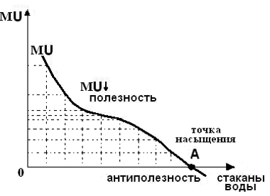

Рис. 2.1  - Убывание полезности последующей единицы потребляемого блага.

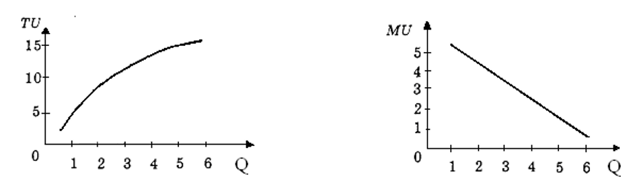

Рис. 2.2 - График общей  полезности                  Рис. 2.3 - График предельной полезности
## Ординалистский подход к оценке полезности
$$\frac {MUx} {Px} \geqslant \lambda$$
$$\frac {MUy} {Py} \leqslant \lambda$$
Ординалистский подход основывается на трех основных аксиомах.

1. Аксиома полной упорядоченности.
   Все наборы товаров можно упорядочить с помощью знаков:            
   $\prec$  (предпочтение) или ~ (безразличие), то есть _А_ $\prec$ _В_ или _А_ ~ _В_.
2. _Аксиома транзитивности._
   Если _А_ $\succ$ _В_ и _В_ $\succ$ С, то _А_ $\succ$ _С_;
   если А $\succ$ _В_ и _В_  ~ _С_, то _А_ $\succ$_С_;
   если _А_ ~ _В_ и _В_ $\succ$ _С_, то _А_ $\succ$ _С_.
3. _Аксиома ненасыщения._ 
   Если в наборе _В_ на единицу меньше, чем в _А_, то _А_ $\succ$ _В_.
   Данный подход предполагает технику кривых безразличия. На основе табл. 3 можно построить линию _ABCD_, представленную на рис. 2.4.
   
   ### **_Свойства кривых безразличия_**:
1. Кривая, лежащая выше и правее ($U_3$), отражает более предпочтительные наборы. Кривая, лежащая ниже и левее ($U_1$), отражает менее предпочтительные наборы. Все наборы товаров, представленные на рис. 2.4, можно упорядочить с помощью знаков предпочтения и безразличия: F $\succ$ A ~ В ~ C ~ D $\succ$ E.
2. Кривые безразличия не пересекаются (доказательство от обратного). Кривые безразличия не могут пересекаться, так как в противном случае нарушатся первая и вторая аксиомы ординалистского подхода.
3. Кривые безразличия имеют отрицательный наклон, поскольку при уменьшении блага _У_ необходимо увеличить благо _Х_, чтобы общая полезность не изменилась.
4. Кривые безразличия являются вогнутыми или выпуклыми в начало координат, что объясняется уменьшающейся предельной нормой замены одного блага другим.

Рис. 2.4 - Карта кривых безразличия

Предельная норма замены блага _У_ благом _Х_ ($MRSxy$) 
$$MRSxy = \frac {\bigtriangleup y} {\bigtriangleup x} = -tg \alpha$$
**Бюджетное ограничение**
$$I = P_Xx + P_yy$$
Выразив из данного уравнения _у_, мы получим следующую запись бюджетного ограничения:
$$y =\frac{I}{Py}-\frac{Px}{Py}x$$

## Оптимум потребителя

**Оптимум** потребителя достигается в том случае, когда предельная норма замены одного товара другим будет равна обратному соотношению цен этих товаров, то есть когда выполнится следующее равенство:
$$MRSxy = - \frac {\bigtriangleup y} {\bigtriangleup x} = - \frac {Px} {Py}$$
С учетом кардиналистского подхода данное равенство можно записать следующим образом:
$$\frac {\bigtriangleup y} {\bigtriangleup x} = \frac {Px} {Py}= \frac{MUx} {MUy}$$
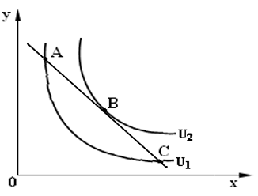

Рис. 2.5 - Оптимум потребителя

## Эффект замены и эффект дохода
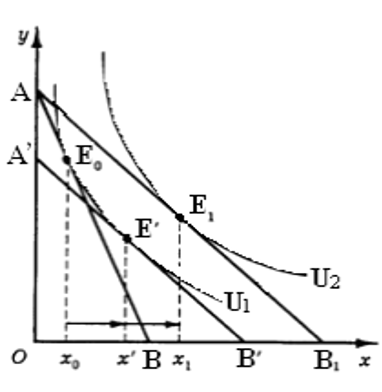

Рис. 2.7- Эффект замены и эффект дохода для качественного блага

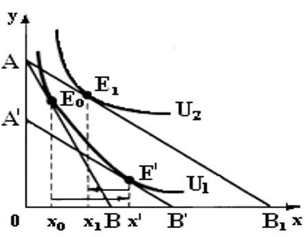

Рис. 2.9- Эффект замены и эффект дохода для низкокачественного блага

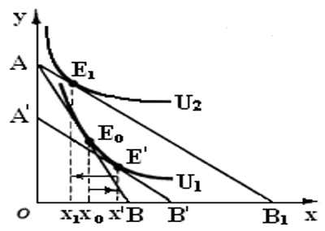

Рис. 2.10 - Эффект замены и эффект дохода для некачественного блага
При этом эффект дохода   ($x_1 – x'$) будет больше замены ($x'-x_0$). Общий эффект будет ($x_1-x_0$) = ($x_1- x'$) – ($x'-x_0$). 
# 3. Коэффициенты эластичности спроса. Факторы, определяющие эластичность. Эластичность предложения и общей выручки.

Точечная: 
$$E = \frac{\partial y}{\partial x}*\frac{x}{y}$$

Дуговая: 
$$E = \frac{\bigtriangleup y}{\bigtriangleup x}*\frac{\overline{x}}{\overline{y}}$$

Коэффициент перекрестной эластичночти:
$$E_{ab}=\frac{\bigtriangleup{Q_a}}{\bigtriangleup{P_b}}* {\frac{\bigtriangleup P_b}{\bigtriangleup Q_a}}$$
	1. если $E_{ab}$ < 0, то товары А и В – взаимодополняемые товары;
	2. если $E_{ab}$ > 0, то товары А и В – взаимозаменяемые товары;
	3. если $E_{ab}$ = 0, то товары А и В – нейтральные товары (цемент и духи).

Эластичный спрос по доходу:
$$E_{ab}=\frac{\bigtriangleup{Q_a}}{\bigtriangleup{I}}* {\frac{\bigtriangleup I}{\bigtriangleup Q_a}}$$
	если $Е_i$ < 0, то товар низкокачественный;
	если $Е_i$ = 0, то это товар, независимый от дохода;
	если $Е_i$ > 0, то товар нормальный, при этом;
	если $Е_i$ < 1, то это товар первой необходимости;
	если $Е_i$ = 1, то это товар второй необходимости;
	если $Е_i$ > 1, то это предмет роскоши.
Эластичность предложения:

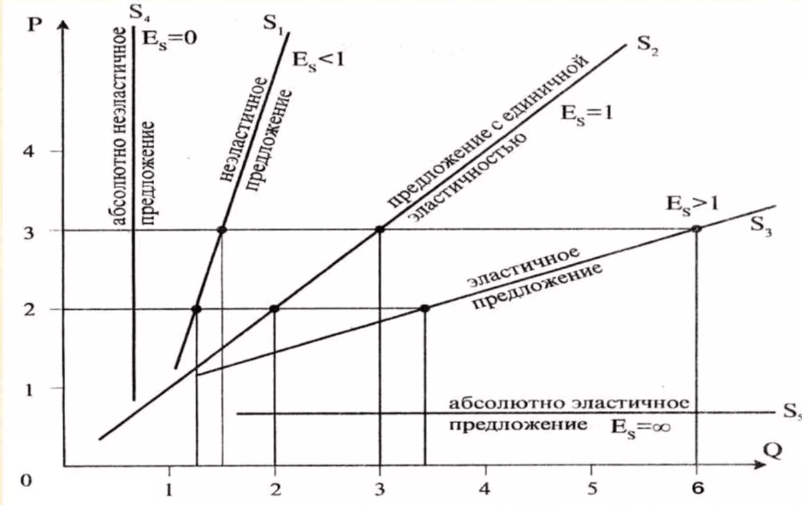

# 4. Производственная функция: общий, средний и предельный продукт. Холм производства и оптимум фирмы. Линия роста фирмы и отдача от масштаба.
$$Q = f(X_1, X_2, ..., X_3) -> max $$где $X_1$ - факторы производства
$$AP = \frac{TP}{X_i}$$
$$MP = \frac{\partial TP}{\partial X_n}$$
Карты изоквант:

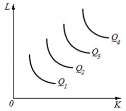

Общий, средний и предельный продукт:

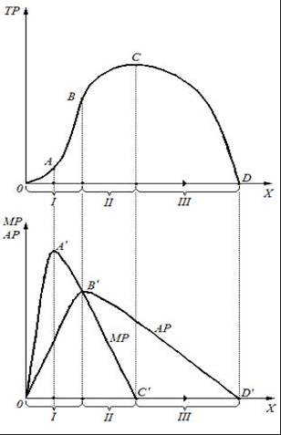

Холм производства:

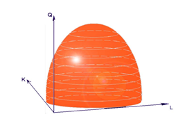

Изокоста:

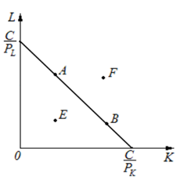

Линии роста фирмы:

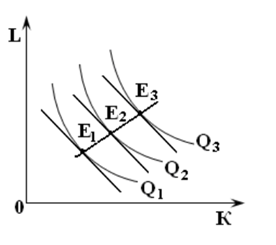

Замещение ресурсов:

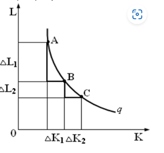
$$MRTS = - \frac{\bigtriangleup L}{\bigtriangleup K}$$

Оптимум фирмы:

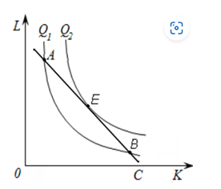

$$MRTS_{KL} = - \frac{\bigtriangleup L}{\bigtriangleup K} = - \frac{\bigtriangleup P_K}{\bigtriangleup P_L} = \frac{ MP_K}{ MP_L}$$ Отдача от масштабов убыв, возр, постоян. 

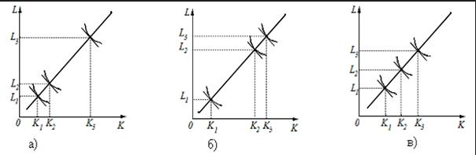

# 5. Затраты фирмы в коротком и длительном периодах. Показатели монопольной власти. Выручка фирмы при совершенной конкуренции и чистой монополии

$$TC = TFC + TVC$$
$$AC = \frac{TC}{Q}$$
$$AFC = {TFC}{Q}$$
$$AVC = \frac{TVC}{Q}$$
$$MC = \frac{{\bigtriangleup TFC} +{\bigtriangleup TVC}}{\bigtriangleup Q} = \frac{\bigtriangleup TVC}{\bigtriangleup Q} = \frac{\partial TC}{\partial Q}$$
	*ТС – общие затраты фирмы.
	TFC  – общие постоянные затраты.
	TVC – общие переменные затраты.
	АC – средние затраты.
	AFC – средние постоянные затраты.
	AVC – средние переменные затраты.
	MC – предельные затраты.*
## Затраты фирмы в коротком и длительном периодах
В коротком:

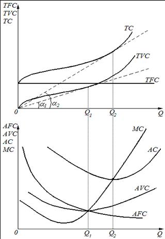

В длительном:

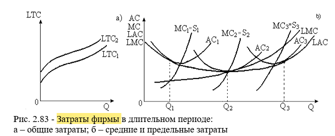

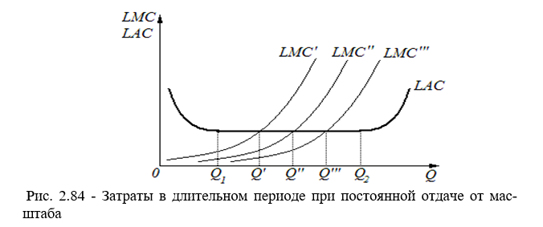

Показатели монопольной власти

Индекс Лернера:

$$I_L = \frac{Pr}{TR} = \frac{1}{e_d}$$
Индекс Херфиндала-Хиршмана:
$$I_h = S_1^2 + S_2^2 + ... + S_n^2$$
> 1800 - высокомонополизированная
> 10000 - монополия

## Выручка фирмы при совершенной конкуренции и чистой монополии

$$TR = P * Q$$
$$AR = \frac{TR}{Q} = \frac{PQ}{Q} = P$$
$$MR = \frac {\bigtriangleup PQ}{\bigtriangleup Q} = P + Q*\frac{\bigtriangleup P}{\bigtriangleup Q}$$
$$MR = \frac {\partial PQ}{\partial Q} = P + Q*\frac{\partial P}{\partial Q} = P(1 + \frac{1}{E})$$
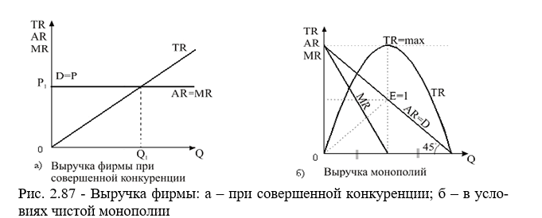

# 6. Условия максимизации прибыли фирмы при совершенной конкуренции: сопоставление TR и TC, MR и MC. Условия максимизации прибыли фирмы при чистой монополии: сопоставление TR и TC, MR и MC.

Условия максимизации прибыли фирмы при совершенной конкуренции при совершенной конкуренции
$$Pr_{max} \rightarrow  MR = MC $$
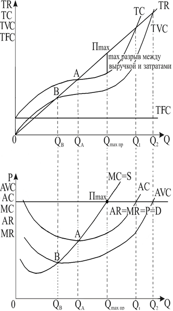

Условия максимизации прибыли фирмы при чистой монополии сопоставления TR и TC, MR и MC.

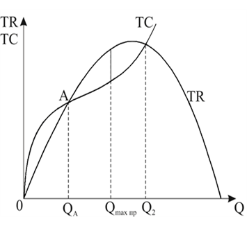

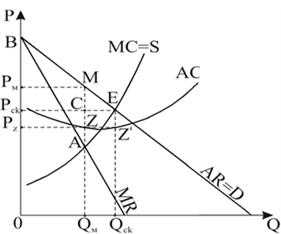

# 7. Ценовая дискриминация: 3 степени ценовой дискриминации. Установление предельных цен, потоварного паушального налогов

Ценовая дискриминация первой степени применяется в основном для эксклюзивных товаров и товаров по индивидуальному заказу.

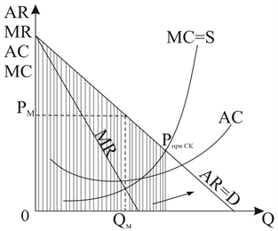

Ценовая дискриминация второй степени связана с системой скидок

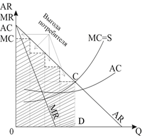

Ценовая дискриминация третьей степени связана с делением самих покупателей на разные группы

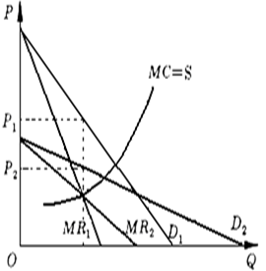

## Установление предельных цен, потоварного и паушального налогов

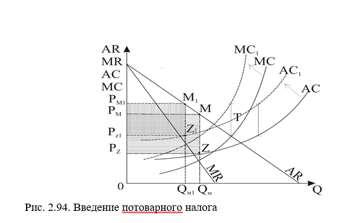

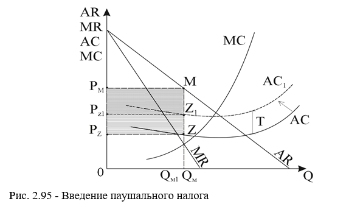

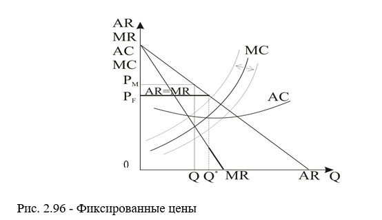

# 8. Регулирование естественной монополии. Поведение фирмы при олигополии и монополистической конкуренции.

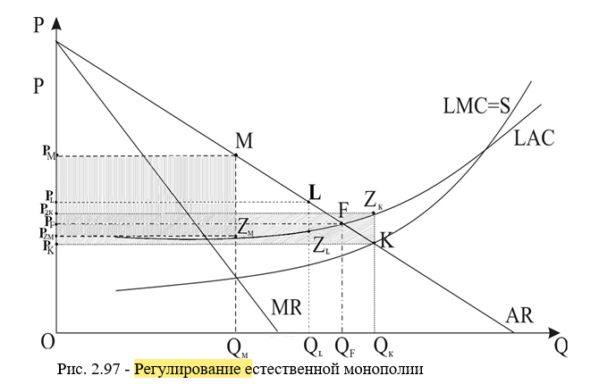

>_Первый вариант_: цена может быть установлена по правилу монополии . В этом случае объем выпуска составит _QM_, а цена реализации – _PM_. При этом монополист получит прибыль, равную площади PMMZмPZм **MR = LMC**
  Второй вариант_: цена может быть установлена по правилу совершенной конкуренции, когда _LMC_ = _LAC_. В этом случае объем производства составит _QК_, а продукция будет реализовываться по цене _PК_. При этом монополист будет нести убытки в размере площади _PZкZкKPK_.  **LMC = AR**
_ Третий вариант_: цену можно установить на уровне средних затрат в длительном периоде. При этом объем производства сократится по сравнению со вторым вариантом незначительно и составит QF. Цена РF является приемлемой, а предприятие будет получать нулевую экономическую прибыль, которая включена в _LAC_. **LAC = AR**

## Поведение фирмы при олигополии и монополистической конкуренции

Олиполия:

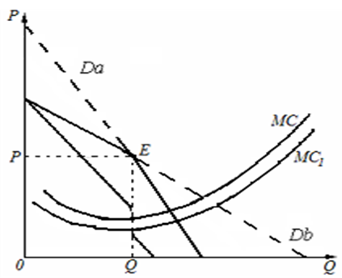

При монополистической конкуренции: 

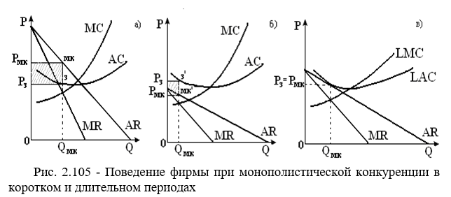

>а - прибыль б - убытки в - нулевая прибыль

# 9. Предельная доходность и стоимость факторов производства. Стоимость предельного продукта и равновесие фирмы. Функция порожденного спроса на факторы производства при совершенной конкуренции и чистой монополии.

Предельная доходность ресурса:
$$MRP(x_i) = \frac{\partial TR(X_i)}{\partial X_i}$$
$$MRP(x_i) = MP(x_i) * MR$$
Предельные издержки ресурса:
$$MIC(x_i) = \frac{\partial TC}{\partial X_i}$$
Стоимость предельного продукта: 
$$VMP(x_i) = P(q) * MP(x_i)$$
Равновесие фирмы:
$$Pr_{max} \rightarrow \frac{\partial TR(x_i)}{\partial X_i}  - \frac{\partial TC(x_i)}{\partial X_i} = 0$$
$$Pr_{max} \rightarrow MRP = MIC$$
Функция порожденного спроса на факторы производства при совершенной конкуренции и чистой монополии

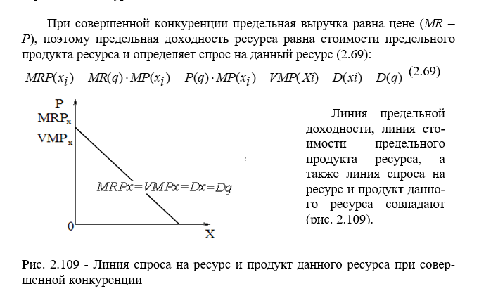

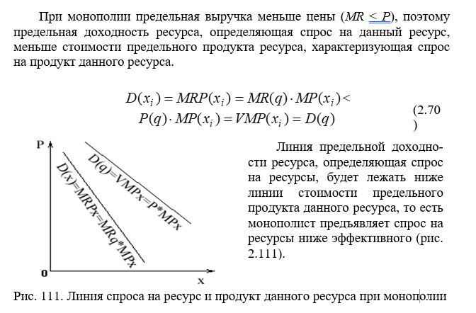

# 10. Рынок труда: условия найма рабочей силы. Спрос на рабочую силу со стороны монопсониста. Спрос на рабочую силу со стороны монопсониста-монополиста.

Условия найма рабочей силы при совершенной конкуренции

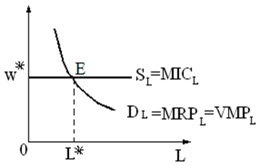

При: $$MRP_L > MIC_L=W$$
Монопсонист на рынке труда

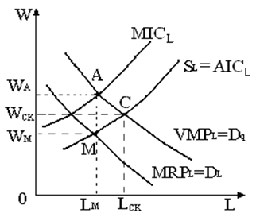

При:
$$VMP > MRP_i$$
Профсоюз при монопсонии:

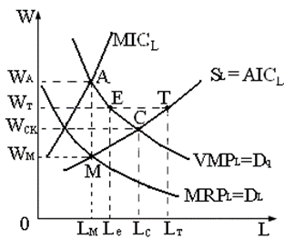

Как уже отмечалось, монопсонист будет нанимать Lм количество работников по заработной плате wм. Профсоюз может установить заработную плату на уровне $W_T$. При данном уровне заработной платы монопсонист в равновесии будет нанимать уже $L_e$ количество работников. Установление профсоюзом заработной платы на уровне $W_T$, дает монопсонисту возможность при необходимости увеличивать найм до объема $L_T$

Найм рабочей силы монопсонистом с монопольной

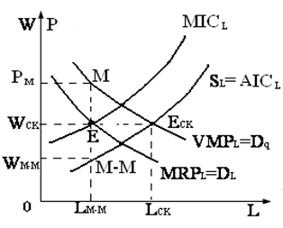

Еще большую прибыль получит монопсонист, обладающий монопольной властью при реализации своей продукции. Он достигает равновесия в точке Е, когда MICL = MRPL.Данной точке оптимума соответствует уровень занятости $L_{м-м}$. При MIC = W уровень заработной платы для $L_{м-м}$ количества работников должен составить $W_{cк}$, но монопсонист будет выплачивать более низкую заработную плату wм-м, соответствующую уровню средних затрат.